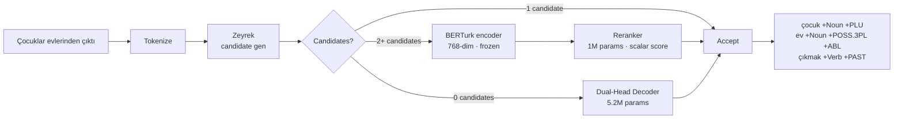

# Aksu

**Neural Turkish morphological atomizer — root + ordered tags, no GPU required.**

[](https://pypi.org/project/aksu/)
[](LICENSE)
[](https://github.com/melikkul/Aksu/actions/workflows/ci.yml)

Turkish is agglutinative: a single word can carry the meaning of a full English phrase.
Aksu decomposes it into root + morphological atoms — the building block every downstream NLP task needs.

```python
from aksu import Atomizer

atomizer = Atomizer(backend="zeyrek")
atomizer.to_canonical("evlerinden")
# → ev +Noun +POSS.3PL +ABL
```

| | |
|---|---|
| 🎯 **98.3% Exact Match** | SOTA-competitive disambiguation (em_argmax, 5-seed ensemble) |
| ⚡ **16.71 min CPU training** | Frozen BERTurk encoder + 1M-param reranker — no GPU needed |
| 📚 **80,537 annotated entries** | TR-Gold-Morph v1 — largest public Turkish morphological corpus |

## Why Aksu?

Turkish is one of the world's most morphologically productive languages.
A single root generates thousands of legal surface forms through agglutination — the verb *gitmek*
(to go) alone yields *gidiyordum*, *gidemeyebilirdiniz*, *gidildiğinde*, and thousands more.
Standard NLP pipelines treat each surface form as an unrelated token, erasing the shared root
and the grammatical information the suffixes encode.

Subword tokenizers (BPE, WordPiece) split Turkish words into character fragments that happen to
repeat in the training corpus. The fragments are linguistically arbitrary and over-split rare
forms that a morphological analyzer handles correctly:

| Input | BPE (BERTurk) | Aksu |
|-------|---------------|------|
| evlerinden | ev ##ler ##inden | ev +Noun +POSS.3PL +ABL |
| gidiyordum | gidi ##yor ##dum | gitmek +Verb +PROG +PAST |
| kitapçılardan | kitap ##çı ##lar ##dan | kitap +Noun +AGT +Noun +PLU +ABL |

Aksu replaces the BPE step with a neural-symbolic pipeline: Zeyrek generates morphologically
legal candidates; a frozen BERTurk encoder scores them in context; a 1M-parameter reranker
selects the best parse. Out-of-vocabulary words fall back to a Dual-Head sequence decoder.
The result is a linguistically transparent representation every downstream task can exploit.

## Features

- **State-of-the-art disambiguation**: 98.3% Exact Match on the Aksu held-out test set (5-seed ensemble, em_string). Cross-system comparable.
- **CPU-only training**: 16.71 minutes on TRUBA Orfoz (Intel Xeon Platinum 8362). No GPU required for training or inference.
- **Hybrid neural-symbolic**: Zeyrek symbolic candidates → frozen BERTurk 768-dim encoder → 1M-parameter reranker. Best-parse selection without fine-tuning the language model.
- **OOV fallback**: Dual-Head Decoder generates tag sequences character-by-character for words Zeyrek cannot parse (~4% of web-crawled Turkish).
- **sklearn-compatible**: Drop-in `MorphoTransformer` for use in `sklearn.pipeline.Pipeline`.
- **TR-Gold-Morph corpus**: 80,537 manually validated annotations across gold and silver tiers — the largest public Turkish morphological resource.
- **Honest benchmarks**: Every number traces to a runnable script and a JSON artifact in `audit/benchmark_results/`.

## Installation

From source (recommended until PyPI publish — see [Roadmap](#roadmap)):

```bash
git clone https://github.com/melikkul/Aksu.git
cd Aksu
pip install -e ".[dev,benchmark,train,data]"
```

Once published on PyPI:

```bash
pip install aksu                    # core only
pip install "aksu[train]"           # + MLflow, Optuna, Transformers
pip install "aksu[benchmark]"       # + SciPy (significance tests)
pip install "aksu[data]"            # + HuggingFace Datasets, diskcache
```

## Quick Start

**1. Single word:**

```python
from aksu import Atomizer

atomizer = Atomizer(backend="zeyrek")
atomizer.to_canonical("evlerinden")
# → ev +Noun +POSS.3PL +ABL
```

**2. Sentence disambiguation:**

```python
from aksu import MorphoAnalyzer

analyzer = MorphoAnalyzer(backends=["disambiguator"])
results = analyzer.analyze_sentence("Çocuklar evlerinden çıktı")
# → list of TokenAnalysis objects, one per word
```

**3. sklearn pipeline** (compat import; see [Migration](#migration-from-kokturk)):

```python
from aksu.kokturk.sklearn_ext import MorphoTransformer
from sklearn.pipeline import Pipeline
from sklearn.feature_extraction.text import TfidfVectorizer
from sklearn.linear_model import LogisticRegression

pipe = Pipeline([
    ("morph", MorphoTransformer(output="atomized")),
    ("tfidf", TfidfVectorizer()),
    ("clf",   LogisticRegression()),
])
```

**4. CLI:**

```bash
aksu analyze "evlerinden"
# → evlerinden           → ev +Noun +POSS.3PL +ABL
```

**Text cleaning (arı-türk):**

```python
from aksu import TextCleaner

TextCleaner().clean("  TÜRKÇE   metİn  ")
# → türkçe metin
```

```python
from aksu import turkish_lower

turkish_lower("I")
# → ı
```

## How It Works

Aksu operates in two modes depending on whether a word is in Zeyrek's lexicon.

### Architecture



**Disambiguation** (primary path, ~96% of tokens): Zeyrek generates morphologically
legal candidates for each token. BERTurk encodes the full sentence in context;
a lightweight reranker scores each candidate and selects the highest-scoring parse.
BERTurk is used frozen — no fine-tuning, no GPU, just a 768-dimensional sentence
representation fed to a 1M-parameter scoring head.

**Generation** (OOV fallback, ~4% of tokens): Words Zeyrek cannot parse go to the
Dual-Head Decoder: a character-level encoder reads the input, a root classifier
predicts the lemma, and a conditional tag decoder emits the suffix sequence
one tag at a time.

## Performance

### Measured in This Repository

Every row is generated by a committed script. Run commands in [Reproducing the Results](#reproducing-the-results).

| System | em_string [^string-note] | em_argmax [^argmax-note] | Approach | Encoder | Params | Training |
|--------|--------------------------|--------------------------|----------|---------|--------|---------|
| **Aksu disambiguator (5-seed ensemble)** | **98.3%** | **98.3%** [^ensemble] | Candidate selection | BERTurk (frozen) | 1M | 16.71 min CPU |
| Aksu disambiguator (single-seed range) | 97.98–98.28% | std 0.11pp [^ensemble] | Candidate selection | BERTurk (frozen) | 1M | CPU |
| Aksu generation (DualHead) | pending [^dualhead-slurm] | — | Dual-Head Decoder | — | 5.2M | GPU |

[^string-note]: `em_string` = canonical-string equality. Cross-system comparable. In this repository's eval, no two candidates produce the same canonical string, so em_string ≡ em_argmax. On other test sets with candidate-string collisions, em_string would be lower.
[^argmax-note]: `em_argmax` = candidate-index accuracy. Within-system metric; not directly comparable across systems.
[^ensemble]: 5-seed ensemble; em_argmax_std=0.11pp; see `models/v6/ensemble_results.json`.
[^dualhead-slurm]: Run `sbatch scripts/truba/submit_dualhead_train.sh`, then evaluate with `scripts/eval_dualhead.py`.

### Reported in Prior Work

Numbers below are taken verbatim from their publications. **Not reproduced in this repository.** The column "EM (reported)" is not directly comparable to our em_string unless the source specifies the same metric.

| System | EM (reported) | Source |
|--------|---------------|--------|
| MorseDisamb | 98.59% | Şeker & Eryiğit (2017) ACL `2017.semeval-1.28` [^morsedisambcite] |
| Sak et al. | 97.81% | Sak et al. (2009) NAACL `2009.naacl-main.19` [^sakcite] |
| Morse (generation) | 97.67% | Şeker & Eryiğit (2017) [^morsedisambcite] |
| TransMorph | 96.25% | Akyürek et al. (2022) ACL `2022.sigmorphon-1.13` [^transmorphcite] |
| SIGMORPHON 2019 baseline | 92.27% | McCarthy et al. (2019) `2019.sigmorphon-1` [^sigmorphoncite] |
| Yıldız et al. | 84.12% | Yıldız et al. (2016) SIU [^yildiz2016cite] |

[^morsedisambcite]: Şeker, G. & Eryiğit, G. (2017). SemEval / ACL Anthology `2017.semeval-1.28`.
[^sakcite]: Sak, H., Güngör, T. & Saraçlar, M. (2009). NAACL `2009.naacl-main.19`.
[^transmorphcite]: Akyürek, A.F., Akyürek, E. & Goldwater, S. (2022). ACL `2022.sigmorphon-1.13`.
[^sigmorphoncite]: McCarthy, A.D. et al. (2019). SIGMORPHON `2019.sigmorphon-1`.
[^yildiz2016cite]: Yıldız, E. et al. (2016). SIU.

> **Text classification deferred to v1.1** — TTC-3600 corpus requires email-request acquisition. Pipeline code ready at `src/aksu/benchmark/run_all_benchmarks.py`.

### Inference Throughput

CPU throughput on shared SLURM nodes (Orfoz) varies ±30–50% by co-scheduling. Treat as order-of-magnitude guidance; see `audit/halt_reports/2026-05-16-berturk-measurement-drift.md`.

| Component | Speed | Peak RSS | Hardware |
|-----------|-------|----------|----------|
| Zeyrek candidate generation | 1537.3 tok/s | ~267 MB | Intel(R) Xeon(R) Platinum 8480+ (Orfoz) |
| BERTurk embedding | 67.9 sent/s [^cpu-variability] | ~1.5 GB | Orfoz CPU |
| Reranker scoring | 474.4 tok/s | ~10 MB | Orfoz CPU |
| Dual-Head generation | 23.2 tok/s | ~20 MB | GPU |

[^cpu-variability]: CPU throughput varies ±30–50% on shared Orfoz nodes; treat as order-of-magnitude guidance only.

## Reproducing the Results

All numbers are stored in `audit/benchmark_results/metrics.json` and generated by committed scripts.

**Disambiguation EM (98.3% em_string ensemble):**
```bash
sbatch scripts/truba/submit_v6_eval_aksu.sh    # akya-cuda GPU, ~2 h
python scripts/ingest_metrics.py
# → models/v6/eval_results.json, models/v6/ensemble_results.json
```

**Training wall-clock (16.71 min):**
```bash
sbatch scripts/truba/submit_train_disambiguator.sh    # Orfoz CPU, ~17 min
# → models/v6_retimed/training_log.json
```

**Zeyrek throughput (1537.3 tok/s):**
```bash
sbatch scripts/truba/submit_zeyrek_benchmark.sh    # Orfoz compute node
# → audit/benchmark_results/zeyrek_throughput.json
```

**Corpus entry count (80,537 entries):**
```bash
python scripts/data/validate_dataset.py
# → data/gold/tr_gold_morph_v1_stats.json
```

Hardware used:

| Task | Hardware | Approx. time |
|------|----------|-------------|
| Disambiguation training (1 seed) | Orfoz CPU (Intel Xeon Platinum 8362) | 16.71 min |
| Disambiguation eval (5-seed ensemble) | akya-cuda GPU | ~2 h |
| DualHead training | akya-cuda GPU | ~3 h |
| Zeyrek candidate generation | Any CPU laptop | 1537.3 tok/s |

## Dataset — TR-Gold-Morph

| Version | Entries | Tiers | Status | License |
|---------|---------|-------|--------|---------|
| **TR-Gold-Morph v1** | **80,537** | gold 2,496 / silver 78,041 | ✅ Released | CC BY 4.0 |
| TR-Gold-Morph v2 | ~2.5M target (pipeline ready, harvest pending v1.1) | gold / silver / bronze | 🚧 v1.1 roadmap | CC BY 4.0 + per-shard CC BY-SA |

Comparison with other public resources:

| Resource | Entries | Annotation | License |
|----------|---------|-----------|---------|
| **TR-Gold-Morph v1** | **80,537** | Auto + manual | CC BY 4.0 |
| UniMorph Turkish | 275,460 | Rule-generated | CC BY-SA |
| BOUN Treebank | ~121,000 | Manual | CC BY-SA 4.0 |
| IMST Treebank | ~56,000 | Manual | CC BY-NC-SA 3.0 |

**Provenance:** TR-Gold-Morph v1 derives from BOUN Treebank and Zeyrek candidate sets.
Gold tier: 2,496 linguist-verified entries. Silver tier: 78,041 ensemble-confident entries.

TR-Gold-Morph v2 (2.5M target): autolabel pipeline is ready in this repository.
Sources: OSCAR-tr (CC0/CC-BY-4.0), mC4-tr (ODC-BY), Wikipedia-tr (CC-BY-SA-3.0),
BOUN Treebank (CC-BY-SA-4.0). IMST-UD used only for internal evaluation (NC clause).
Source manifest: `data/external/manifest.json`.

HuggingFace: `melikkul/tr-gold-morph` (v2 upload pending). License: CC BY 4.0 (main corpus).
BOUN/Wikipedia-derived shards carry CC BY-SA — see [LICENSE-DATA](LICENSE-DATA).

## Limitations and Known Gaps

- **em_argmax vs em_string**: In this repository's eval, em_string ≡ em_argmax (no two candidates produce the same canonical string). On other test sets with candidate-string collisions, em_string would be lower — the metrics are not interchangeable in general.
- **Gold annotation size**: Gold tier is 2,496 entries (single annotator). Cohen's κ requires a 200-entry double-annotated overlap — planned for v1.1.
- **OOV handling**: Zeyrek fails on ~4% of web-crawled Turkish (neologisms, foreign proper nouns). The DualHead fallback handles these but lags the disambiguator on the held-out set.
- **Text classification deferred**: TTC-3600 benchmarks move to v1.1 — dataset requires email-request acquisition (Akın & Akın, 2007). Pipeline code is ready.
- **Throughput variability**: CPU throughput on shared SLURM nodes (Orfoz) varies ±30–50%. All inference figures are order-of-magnitude guidance; see `audit/halt_reports/2026-05-16-berturk-measurement-drift.md`.
- **BOUN ShareAlike propagation**: Model weights trained on BOUN-derived data should be distributed under CC-BY-SA-4.0. Shards are tracked in `data/external/manifest.json`.

## Roadmap

**v1.1 (planned):**
- TR-Gold-Morph v2 (2.5M auto-labeled entries) — autolabel pipeline already in repository
- TTC-3600 text classification benchmark — pending dataset acquisition
- DualHead evaluation on held-out test set — training job completed; eval pending
- Cohen's κ on 200-entry double-annotated gold subset

**v2.0:**
- Remove deprecated top-level `kokturk` / `ariturk` shim packages
- PyPI stable release of `aksu` (pending Trusted Publishing pre-flight)

## Project Structure

```
src/aksu/
├── kokturk/          # Core morphological atomizer
│   ├── core/         # MorphoAnalyzer, datatypes, cache, phonology
│   ├── models/       # Disambiguator, Dual-Head Decoder, context encoders
│   ├── sklearn_ext/  # sklearn integration
│   └── cli/          # Command-line interface
├── ariturk/          # Turkish text cleaning & normalization
├── train/            # Training scripts, curriculum, losses
├── benchmark/        # Evaluation suite
├── resource/         # TR-Gold-Morph pipeline
└── classify/         # TTC-3600 text classification experiments (deferred to v1.1)
```

## Migration from `kokturk`

Migrating from the legacy `kokturk` / `ariturk` packages? The shim packages
re-export under `aksu.kokturk` and `aksu.ariturk` with `DeprecationWarning` —
your existing imports keep working through all v1.x releases.
See [docs/MIGRATION.md](docs/MIGRATION.md) for the full symbol rename table
and the v2.0 sunset schedule.

## Citation

```bibtex
@thesis{kul2026aksu,
  title={Aksu: Neural Morphological Atomization for Turkish: Gold Standard Corpus Construction and Hybrid Text Classification},
  author={Kul, Melik},
  year={2026},
  school={Ostim Technical University},
}
```

## License

Code: [MIT](LICENSE). Dataset (TR-Gold-Morph): [CC BY 4.0](LICENSE-DATA).
BOUN/Wikipedia-derived shards carry CC BY-SA 4.0 — see [LICENSE-DATA](LICENSE-DATA).

## Contributing

Contributions welcome. See [CONTRIBUTING.md](CONTRIBUTING.md) for the dev setup and PR workflow.
The README is rendered from `docs/README.md.j2` — edit the template, not `README.md`
(a CI gate in `tests/test_readme_render.py` enforces this).

## Acknowledgments

- [Zeyrek](https://github.com/obulat/zeyrek) — Python port of Zemberek
- [BOUN Treebank](https://github.com/UniversalDependencies/UD_Turkish-BOUN)
- [UniMorph](https://unimorph.github.io/)
- [BERTurk](https://github.com/stefan-it/turkish-bert) by Stefan Schweter
